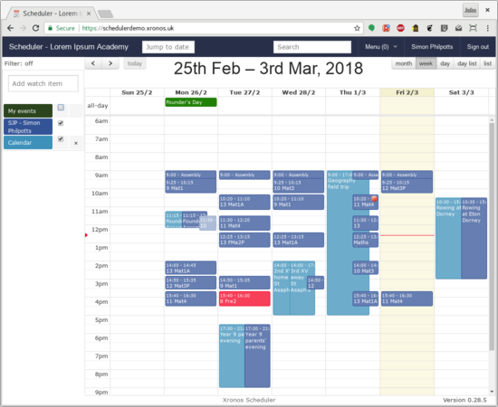

# Xronos Scheduler

Xronos Scheduler is a calendaring application intended primarily
for schools, but potentially useful for other organisations.

It stores and displays not just the school's timetable (or timetables)
but also everything else which is happening within the school, enabling
easy retrieval of a tailored schedule for any individual member of staff,
pupil, location, service, activity etc. within the school.

What sets it apart from the vast majority of calendar programs (Google
Calendar and the like) is that the information which it holds is _structured_.
Rather than having hundreds of separate calendars, it holds just the one
calendar, but then allows potentially thousands of different views on it.
This is really important in a school - everything which is happening makes
use of the same scarce resources (people, places, things) and the
commitments need to be held in a single place.

Users (staff, pupils and the general public) see information tailored
to their particular requirements.  The general public can see only things
flagged as being for public consumption; staff and pupils can see their
own commitments (timetable + everything else) and suitably authorized
users (under the control of the system administrator) can choose what
they see.

The data held within Scheduler can be fed out to external calendaring
programs, and to hand-held devices.  It updates automatically from
the school's MIS, and provides automated notification of clashes
where events are arriving from different sources.

For a general introduction, see the [User Guide](https://xronos.uk/)
and the [live demonstration site](https://schedulerdemo.xronos.uk/).

[Installation instructions](https://xronos.uk/install/) are also available.

Xronos Scheduler is licensed under the GNU General Public Licence, version 2.

